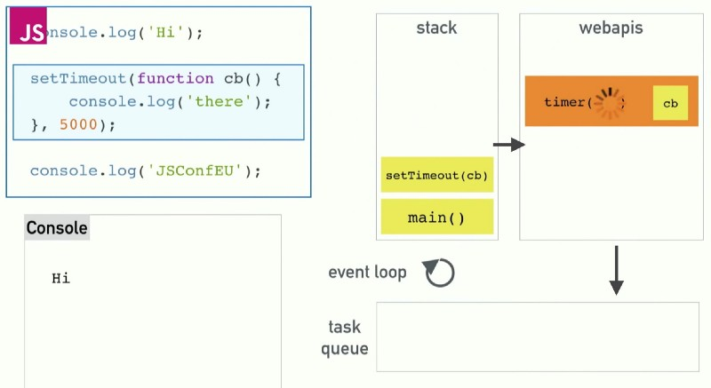

# Exercises:

For exercises, please check the folders for each week, above.

# Learning goals: Period 1 (To be updated continuously)

## Differences between Java and JavaScript + node.

**General differences in language features.**

- Java is a compiled language and JavaScript a scripted language
- Java is both a language and a platform
- JavaScript code runs in a browser environment (Typically, but not with Node!) while Java typically runs in the Java Virtual Machine (JVM).
- In Java, programs cannot run without being part of a class.
- Java has a thread based approach to concurrency while JavaScript has an event based approach.

## NodeJS & npm - when does it "Make sense" to use

JavaScript is becoming one of the most sought-after language skills.  
Using Node.js in both the front-end and backend "Simplifies" the stack by unifying the language and dataformat(JSON) used.  
NodeJS is a good choice for web applications as it doesn't depend on traditional servers with limited thread pools (Or waiting for available threads) as it relies on event-based executions on a single thread.

Due to its event-driven, single-threaded event loop and asynchronous non-blocking I/O model, Node.js performs best on intense I/O applications requiring speed and scalability with lots of concurrent connections, like video & audio streaming, real-time apps, live chats, gaming apps, collaboration tools,

NPM - the node package manager is exactly what the name implies.  
It allows for an easy way to define what packages a project depends on and generally allows for modular solutions. A useful NPM module could, for instance, be "express.js".

## The Event Loop in JavaScript

**blocking & non-blocking**  
Blocking refers to operations that _block_ further execution until an operation finishes.  
Non-blocking refers to code that doesn't block execution.  
Generally, you can say that, blocking methods execute synchronously while non-blocking methods execute asynchronously.

**The event loop**  
The event loop is what allows Node to perform non-blocking operations despite JavaScript being single-threaded.  
The loop, which runs on the same thread as the JavaScript code, grabs a task from the code (In the stack) and executes it.  
If the task is async or an I/O operation the loop offloads it to a web API (setTimeout here).  
The loop then grabs the next task and executes it.
When one of these _events_ completes (this is an event) it is moved to the task queue and eventually added to the stack to be executed.

Check out ["Loupe"](http://latentflip.com/loupe/) to see this in action



**Callback queue and other API's**  
setTimeout() is an obvious example of a Web API provided by the browser that adds to the V8 engine in Chrome and Node.  
Web API calls are added to the Web API container from the call stack. Calls to the web API could be click events, HTTP requests or a timer that finishes - events!

## What does it mean if a method in nodes API's ends with xyzSync​?

It means that the method is probably synchronous or asynchronous.  
For instance:

**Synchronous**

```javascript
const fs = require("fs");
const data = fs.readFileSync("/file.md"); // blocks here until file is read
console.log(data);
moreWork(); // will run after console.log
```

**Asynchronous**

```javascript
const fs = require("fs");
fs.readFile("/file.md", (err, data) => {
  if (err) throw err;
  console.log(data);
});
moreWork(); // will run before console.log
```

## The JavaScript Engine and JavaScript Runtime Environment

**The engine**
The engine is responsible for _interpreting_ the code and translate it to machine code and then executing the code.  
(For Java we would have to compile the code and would be able to recieve compilation errors).

Notable Javascript engines:

- V8 by google for chrome (And Node)
- SpiderMonkey by Mozilla for firefox

**The runtime environment**  
In web development the engine is seldom used directly because the engine works within an _environment_ that provides additional features like the web APIs mentioned above.

Notable JavaScript Runtime Environments

- The browser environment (For instance powered by V8 in Chrome)
- NodeJS powered by V8, but not providing the DOM tree, AJAX, etc. Allows for installing packages to support these.

## Babel & WebPack

**Babel**  
Babel is a toolchain that is mainly used to convert ECMAScript 2015+ code into a backwards compatible version of JavaScript in current and older browsers or environments.  
Babel can be configured using a `.babelrc` file - eg:

```
{
    "presets": ["@babel/preset-env"]
}
```

[`@babel/preset-env`](https://babeljs.io/docs/en/babel-preset-env) is a smart preset that allows you to use the latest JavaScript without needing to micromanage which syntax transforms (and optionally, browser polyfills) are needed by your target environment(s).

**Webpack**  
Webpack is a tool that lets you compile JavaScript modules, also known as module bundler.  
Given a large number of files, it generates a single file (or a few files) that run your app.  
We can configure webpack to define where output is saved, what plugins to use, tools used in dev environments etc.  
Webpack can be configured using a `.webpack.config.js` file - eg:

```javascript
const path = require("path");
const HtmlWebpackPlugin = require("html-webpack-plugin");
const {
  CealnWebpackPlugin,
  CleanWebpackPlugin,
} = require("clean-webpack-plugin");

module.exports = {
  entry: {
    index: "./src/index.js",
    print: "./src/print.js",
  },
  devtool: "inline-source-map",
  devServer: {
    contentBase: "./dist",
  },
  plugins: [
    new CleanWebpackPlugin({ cleanStaleWebpackAssets: false }),
    new HtmlWebpackPlugin({
      title: "Output Management",
    }),
  ],
  output: {
    filename: "[name].bundle.js",
    path: path.resolve(__dirname, "dist"),
  },
};
```

## Variable/function-Hoisting

**Variables**  
Hoisting is JavaScript's default behavior of moving declarations to the top.
Some variable types are hoisted to the top of the scope when the code is executed, but they behave differently.  
`let` and `const` are hoisted to the top but not initialized which will return errors.

**Functions**  
Function hoisting occurs for function declarations - not function expressions. For example:

```javascript
// Outputs: "Definition hoisted!"
definitionHoisted();

// TypeError: undefined is not a function
definitionNotHoisted();

function definitionHoisted() {
  console.log("Definition hoisted!");
}

var definitionNotHoisted = function () {
  console.log("Definition not hoisted!");
};
```

A good rule of thumb is to declare your variables at the top!

## this​ in JavaScript and how it differs from what we know from Java/.net.
The definition of `this` in JavaScript from [W3 Schools](https://www.w3schools.com/js/js_this.asp)
```
In a method, this refers to the owner object.
Alone, this refers to the global object.
In a function, this refers to the global object.
In a function, in strict mode, this is undefined.
In an event, this refers to the element that received the event.
```

For objects in JavaScript `this` refers to the owner object - in this case "person":  
```javascript
var person = {
  firstName: "John",
  lastName : "Doe",
  id       : 5566,
  fullName : function() {
    return this.firstName + " " + this.lastName;
  }
};
```

In Java `this` is a reference to the object of the current class within an instance method or constructor.  

The main difference between the two is that `this` changes (More) in JavaScript depending on context.

## Function Closures and the JavaScript Module Pattern

asd

## User-defined Callback Functions (writing functions that take a callback)

asd

## Explain the methods ​map​, ​filter​ ​and ​reduce

asd

## Provide examples of user-defined reusable modules implemented in Node.js (learnynode - 6)

asd

## Provide examples and explain the es2015 features: ​let, arrow functions, this, rest parameters, destructuring objects and arrays,​ ​ maps/sets​ etc.

asd

## Explain and demonstrate, how to implement event-based code, how to emit events and how to listen for such events

asd

<h3 style="background-color: yellow; color: black">Provide an example of ES6 inheritance and reflect over the differences between Inheritance in Java and in ES6.</h3>
asd

<br>
<br>

## ES6,7,8,ES-next and TypeScript

### Provide examples with es-next, running in a browser, using Babel and Webpack

asd

### Explain the two strategies for improving JavaScript: Babel and ES6 + ES-Next, versus Typescript.

asd

### What does it require to use these technologies: In our backend with Node and in (many different) Browsers

asd

### Provide​ examples​ to demonstrate the benefits of using TypeScript, including, types, interfaces, classes and generics

asd

### Explain how we can get typescript code completion for external imports.

asd

### Explain the ECMAScript Proposal Process for how new features are added to the language (the TC39 Process)

asd

## Callbacks, Promises and async/await

### ES-6 promises in JavaScript

including, the problems they solve, a quick explanation of the Promise API and:

### how to avoid the callback hell (“Pyramid of Doom")

asd

### How to execute asynchronous (promise-based) code in ​serial​ or parallel

asd

### How to implement ​your own​ promise-solutions.

asd

### Example(s) that demonstrate error handling with promises

asd

### JavaScripts ​async/await​

how it relates to promises and reasons to use it compared to the plain promise API.  
Provide examples to demonstrate

#### Why this often is the preferred way of handling promises

asd

#### Error handling with async/await

asd

#### Serial or parallel execution with async/await.

asd
